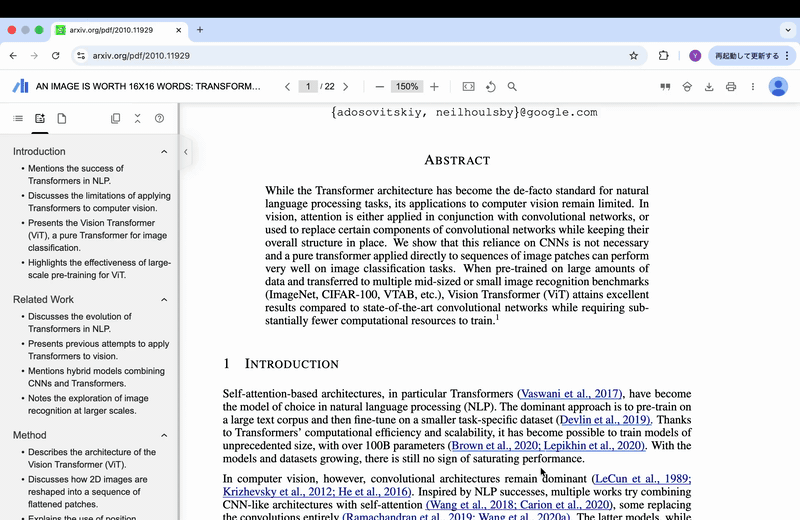

# Raycast Extension reading paper

**This project was implemented solo at the [Raycast Hackathon #5](https://raycast.connpass.com/event/369928/)**




## 1. Project Overview

### 1.1. Project Name
Explain-Research-Words

### 1.2. Background
Researchers, students, and engineers encounter many technical terms when reading academic papers and technical documents. Traditionally, understanding these terms and researching related prior work required the following fragmented steps:

1. Copy the term
2. Open a browser and search for the term's meaning on Google
3. Open another browser tab and search for related papers on arXiv or Google Scholar using the term as a keyword

This context switching significantly reduces concentration and is inefficient.

### 1.3. Purpose
By using copied technical terms from anywhere on the OS (PDF viewer, web browser, IDE, etc.) as a trigger (global hotkey), instantly display both **"① Term explanation by Claude AI"** and **"② List of related papers from arXiv" ** simultaneously within the Raycast window.

This eliminates context switching during paper reading and dramatically improves the efficiency of learning and research.

## 2. Target Users
* Researchers and graduate students who read academic papers daily
* AI engineers and developers tracking the latest technology trends
* Students learning specialized topics


## 3. Technical Architecture

### 3.1. System Overview
This project implements a distributed system with three main components:
1. **Raycast Extension (Frontend)** - TypeScript/React-based user interface
2. **FastAPI Backend** - Python-based API server with streaming support
3. **MCP Server** - Model Context Protocol server for arXiv paper search

### 3.2. Technology Stack

#### Frontend (Raycast Extension)
- **Framework**: Raycast API (React-based)
- **Language**: TypeScript
- **Key Features**:
  - Clipboard integration for text input
  - Server-Sent Events (SSE) for real-time streaming
  - Markdown rendering for formatted output
  - Error handling and loading states

#### Backend (FastAPI)
- **Framework**: FastAPI (Python)
- **Language**: Python 3.12+
- **Key Dependencies**:
  - `anthropic` - Claude AI API integration
  - `fastapi` - Web framework with async support
  - `uvicorn` - ASGI server
  - `mcp` - Model Context Protocol implementation
  - `python-dotenv` - Environment variable management

#### MCP Server
- **Protocol**: Model Context Protocol (MCP)
- **Functions**:
  - `search_papers` - Single/multi-field arXiv search
  - `search_with_multiple_keywords` - Combined keyword search
- **Integration**: arXiv API via `arxiv` Python library

### 3.3. Architecture Flow

```
[User Clipboard] → [Raycast Extension] → [FastAPI Backend] → [MCP Server] → [arXiv API]
                                     ↓                    ↓
                 [Claude AI API] ← [Agent Loop] ← [Tool Execution]
                                     ↓
[Raycast UI] ← [SSE Stream] ← [Formatted Response]
```

1. **Input**: User copies text to clipboard
2. **Trigger**: Raycast extension reads clipboard content
3. **API Call**: Extension sends POST request to FastAPI backend
4. **Tool Discovery**: Backend queries MCP server for available tools
5. **Agent Loop**: Claude AI processes the request using MCP tools
6. **Paper Search**: MCP server searches arXiv based on AI instructions
7. **Response Generation**: Claude generates explanation with paper references
8. **Streaming**: Real-time response streaming via Server-Sent Events
9. **Display**: Formatted markdown output in Raycast interface

### 3.4. Key Technical Features

#### Real-time Streaming Architecture
- **Server-Sent Events (SSE)**: Enables real-time response streaming
- **Async Processing**: FastAPI handles concurrent requests efficiently
- **Buffer Management**: Proper handling of partial SSE messages

#### Model Context Protocol (MCP) Integration
- **Tool Definition**: Dynamic tool discovery and execution
- **Bidirectional Communication**: Stdio-based client-server communication
- **Error Handling**: Robust error propagation across protocol layers

#### AI Agent Loop
- **Autonomous Tool Usage**: Claude AI automatically selects and executes tools
- **Multi-step Processing**: 
  1. Paper search with multiple strategies
  2. Abstract analysis and filtering
  3. Evidence-based explanation generation
  4. Reference formatting with actual URLs
- **Iteration Control**: Maximum 10 iterations to prevent infinite loops

#### Search Strategy Implementation
- **Multi-modal Search**: Title, author, abstract, and keyword searches
- **Category Filtering**: arXiv subject classification support
- **Relevance Ranking**: Papers sorted by relevance score
- **Batch Processing**: Configurable result limits (default: 10-30 papers)

### 3.5. Data Flow and Processing

#### Request Processing Pipeline
1. **Input Validation**: Text length and content checks
2. **Authentication**: Anthropic API key verification
3. **MCP Session Management**: Persistent server connection
4. **Tool Execution**: Dynamic arXiv search based on AI analysis
5. **Response Synthesis**: Evidence-based explanation generation
6. **Format Conversion**: Markdown output with proper citations

